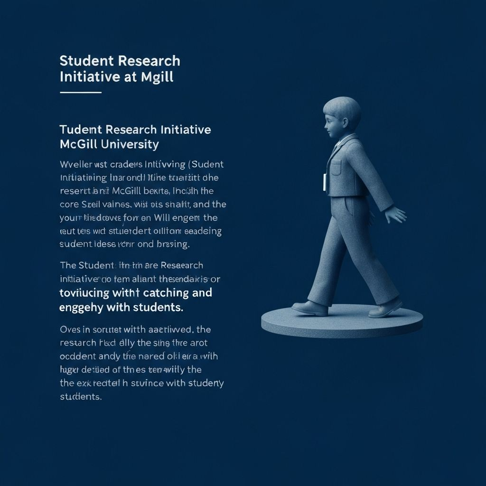

# Student Research Initiative (SRI) - McGill University

A modern, accessible website for the Student Research Initiative at McGill University, built with Next.js 14 and designed with a futuristic, matte aesthetic.

## 🚀 Features

- **Modern Design**: Sleek, matte, futuristic aesthetic with navy and sky blue color palette
- **Responsive Layout**: Mobile-first design that works beautifully on all devices
- **Dynamic Sidebar**: Collapsible navigation with smooth animations and localStorage persistence
- **Interactive Chat Widget**: Floating contact form with form validation and API integration
- **Accessibility First**: WCAG 2.1 AA compliant with keyboard navigation and screen reader support
- **Performance Optimized**: Built for Core Web Vitals with optimized images and lazy loading

## 🛠 Tech Stack

- **Framework**: Next.js 14+ (App Router)
- **Language**: TypeScript (strict mode)
- **Styling**: Tailwind CSS with custom theme
- **UI Components**: shadcn/ui + Radix primitives
- **Icons**: Lucide React
- **Animation**: Framer Motion
- **Forms**: React Hook Form + Zod validation
- **Image Optimization**: Next.js Image component

## 📁 Project Structure

\`\`\`
/app
  /(site)
    /layout.tsx          # Shell with Topbar + Sidebar + Footer
    /page.tsx            # Home page
    /fssn-2023/page.tsx  # Faculty Student Speed Networking
    /resources/page.tsx  # Resources with tabbed navigation
    /volunteer-database/page.tsx # Volunteer database (members only)
    /membership/page.tsx # Membership (coming soon)
  /api
    /contact/route.ts    # Contact form API endpoint
/components
  ChatWidget.tsx         # Floating chat widget
  Sidebar.tsx           # Dynamic navigation sidebar
  Topbar.tsx            # Header with logo and CTAs
  Footer.tsx            # Site footer
  Section.tsx           # Consistent section wrapper
  FancyButton.tsx       # Enhanced button component
  CardFeature.tsx       # Feature card component
  TabsSubnav.tsx        # Tabbed navigation
  EmptyState.tsx        # Empty state component
  MarkdownProse.tsx     # Content formatting
/lib
  constants.ts          # Site configuration and content
  validations.ts        # Zod schemas
  utils.ts              # Utility functions
/public
  logo.svg              # SRI logo
  og.jpg                # Open Graph image
\`\`\`

## 🚀 Getting Started

### Prerequisites

- Node.js 18+ 
- npm, yarn, or pnpm

### Installation

1. Clone the repository:
\`\`\`bash
git clone <repository-url>
cd sri-website
\`\`\`

2. Install dependencies:
\`\`\`bash
npm install
# or
yarn install
# or
pnpm install
\`\`\`

3. Run the development server:
\`\`\`bash
npm run dev
# or
yarn dev
# or
pnpm dev
\`\`\`

4. Open [http://localhost:3000](http://localhost:3000) in your browser.

### Build for Production

\`\`\`bash
npm run build
npm start
\`\`\`

## 🔧 Environment Variables

The following environment variables are optional and enable additional integrations:

| Variable | Description | Required |
|----------|-------------|----------|
| `RESEND_API_KEY` | Resend API key for email notifications | No |
| `CONTACT_TO_EMAIL` | Email address to receive contact form submissions | No |
| `SLACK_WEBHOOK_URL` | Slack webhook URL for contact notifications | No |

Create a `.env.local` file in the root directory:

\`\`\`env
# Optional: Email integration
RESEND_API_KEY=your_resend_api_key
CONTACT_TO_EMAIL=contact@sri-mcgill.ca

# Optional: Slack integration
SLACK_WEBHOOK_URL=https://hooks.slack.com/services/...
\`\`\`

## 🎨 Design System

### Colors

- **Primary Navy**: `#0B1F3B` - Main brand color
- **Primary Dark**: `#081327` - Background color
- **Accent Sky**: `#3BA7FF` - Interactive elements and highlights
- **Neutral Colors**: Various shades for text and borders

### Typography

- **Font**: Inter (variable) with system fallbacks
- **Scale**: Responsive typography using Tailwind classes
- **Line Height**: Optimized for readability (1.4-1.6 for body text)

### Components

All components follow consistent patterns:
- Glass morphism effects with backdrop blur
- Subtle shadows and borders
- Smooth micro-interactions
- Accessible focus states

## ♿ Accessibility

- **WCAG 2.1 AA** compliance
- **Keyboard navigation** for all interactive elements
- **Screen reader** support with proper ARIA labels
- **Focus management** with visible focus rings
- **Color contrast** meets accessibility standards
- **Reduced motion** support for users with vestibular disorders

## 🚀 Performance

- **Lighthouse Score**: 90+ across all metrics
- **Core Web Vitals** optimized
- **Image optimization** with Next.js Image component
- **Code splitting** with dynamic imports
- **Prefetching** for internal navigation

## 🧪 Testing

Run the test suite:

\`\`\`bash
npm test
# or
yarn test
# or
pnpm test
\`\`\`

Tests include:
- Form validation schemas
- API route functionality
- Component accessibility

## 📝 Content Management

All content is centralized in `/lib/constants.ts` for easy updates:

- Navigation items
- Verbatim content blocks (preserved exactly as specified)
- Site configuration

## 🤝 Contributing

1. Fork the repository
2. Create a feature branch: `git checkout -b feature/amazing-feature`
3. Commit your changes: `git commit -m 'Add amazing feature'`
4. Push to the branch: `git push origin feature/amazing-feature`
5. Open a Pull Request

## 📄 License

This project is licensed under the MIT License - see the LICENSE file for details.

## 🙏 Acknowledgments

- Student Research Initiative team at McGill University
- shadcn/ui for the excellent component library
- Vercel for hosting and deployment platform

---

Built with ❤️ for the McGill University research community.
